# Espruino Workshop

## Kit Contents

Your kit should have:

* An [Espruino Pico](http://www.espruino.com/Pico)
* A USB Type A extension
* A [Breadboard](http://www.espruino.com/Breadboard) and patch wires
* 4 LEDs
* 4 75 Ohm Resistors
* A [Piezo Speaker](http://www.espruino.com/Speaker)
* A [PCD8544 display](http://www.espruino.com/PCD8544)

## Getting your Espruino up and running

Install the Espruino Web IDE in Google Chrome - [you can find it here](https://chrome.google.com/webstore/detail/espruino-web-ide/bleoifhkdalbjfbobjackfdifdneehpo) on the Chrome Web Store.

**Mac Users:** Your'e good to go!

**Windows Users:** You'll need to install drivers [from here](http://www.espruino.com/files/stm32_vcp_1.4.0.zip) first, *then* you need to go to `C:\Program Files (x86)\STMicroelectronics\Software\Virtual comport driver` and run `dpinst_amd64.exe` (or `x86` if you're on a 32 bit system).

**Linux Users:** to get the correct permissions to connect as a normal user you'll need to copy [the file 45-espruino.rules](https://github.com/espruino/Espruino/blob/master/misc/45-espruino.rules) to `/etc/udev/rules.d` and to ensure your user is in the 'plugdev' group (you can check by typing ```groups```). You add it by typing ```sudo adduser $USER plugdev``` and then logging out and back in.

### The IDE

Just a quick intro to the IDE. There’s an orange connect button on the top left, so when you have your Espruino plugged in to your computer, you can click that to connect it. There’s a console on the left which works much like any console or terminal. Just type code in and watch it run. Down the middle are a number of action buttons that do things such as open and save code as well as upload it to run on your Espruino. And last but not least, on the right is the code editor, this is where you edit the file(s) for your project to run on your device.

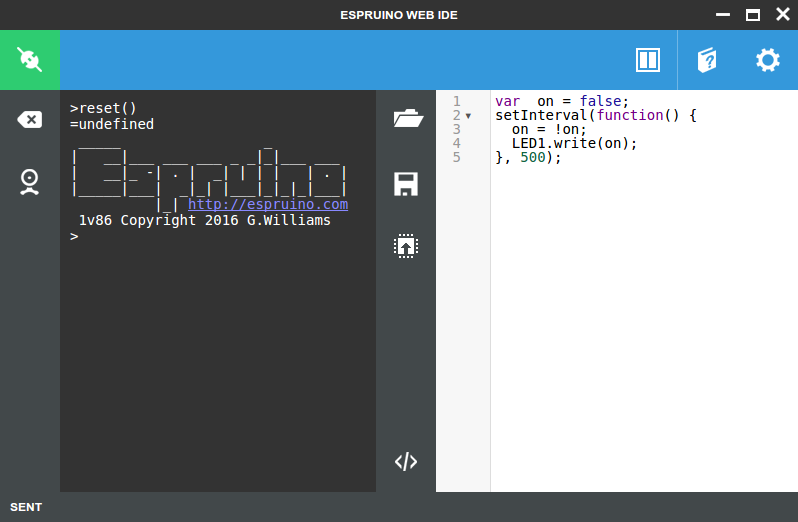

If you want to get to grips with it in more detail, check out [the Quick Start Guide](http://www.espruino.com/Quick+Start) on Espruino's website.

### Updating firmware

The Espruino software's being updated all the time, and the version that's on your board when it comes from the factory will almost certainly be out of date.

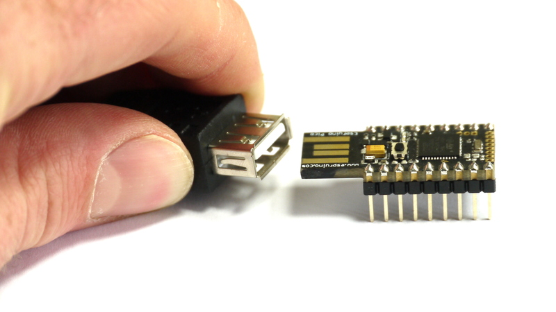

To update it, make sure you have an internet connection, connect your Espruino board to USB (it's a good idea to use an extension lead) and connect with the Web IDE (the top-left button). If you see a yellow warning marker in the top right of the Web IDE then new firmware is available. Click on it (or click the `Settings` icon, then `Flasher`), click `Flash Firmware` and follow the instructions. In the drop-down list of different firmwares leave the default (WIZnet) chosen. There is no risk of damaging your Espruino board, however the firmware update process may take a few minutes to complete. If you have problems, check out the [Troubleshooting](http://www.espruino.com/Troubleshooting) guide.

Now we’ve got that out the way we can crack on with a bit of code.

## Task One: Beginner Screen & Button

### Get the screen up and running

Grab this ‘Simple Screen’ starter code below and paste it into the IDE on the **right hand** side. (If you want to delve deeper into the screen starter code check out [this link which goes through it in more depth](http://www.espruino.com/Pico+LCD+Hello+World) )

```
A5.write(0); // GND
A7.write(1); // VCC
A6.write(0); // Turn on the backlight

var g; // Graphics - define globally, so it can be used by other functions

function onInit() {
  // Setup SPI
  var spi = new SPI();
  spi.setup({ sck:B1, mosi:B10 });
  // Initialise the LCD
  g = require("PCD8544").connect(spi,B13,B14,B15, function() {
    // When it's initialised, clear it and write some text
    g.clear();
    g.drawString('Hello World!',0,0);
    // send the graphics to the display
    g.flip();
  });
}

onInit();
```

Now hook up all the electronics. You want to place the Espruino on the breadboard with the USB connector on the left, with the top pins on the top half and the bottom pins on the bottom half. Now you want to place the screen above it, with the screens pins  lined up with the right side of the Espruino, (so ‘Gnd’ on the screen is inline with the far right pin on the Espruino).

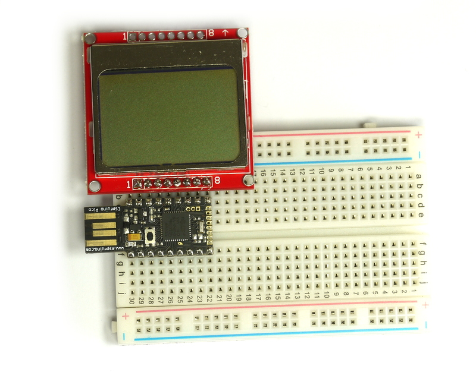

Connect the Espruino with your computer’s USB port and click on the orange connect/disconnect button on the top left of the IDE. Select the correct USB port, usually indicated by ‘Esprino Board’ being shown underneath the name of the port. The IDE should tell you the Espruino has been connected and the connect/disconnect button on the top left should turn green.

Now upload your code! The up facing arrow button in the middle of the IDE does this, so go ahead and click that. Your screen should turn on and say `Hello World`.

If it doesn’t try some simple (I don’t mean bug fixing.. what do I mean?). Check the Espruino and board are in the bread board correctly and the Espruino is connected to the USB port ok. Once in the IDE make sure you copy and pasted the code correctly and the Espruino is connected and the code is uploading.

#### About breadboards

So why did this work? Well, breadboards have their wires shorted together as follows:

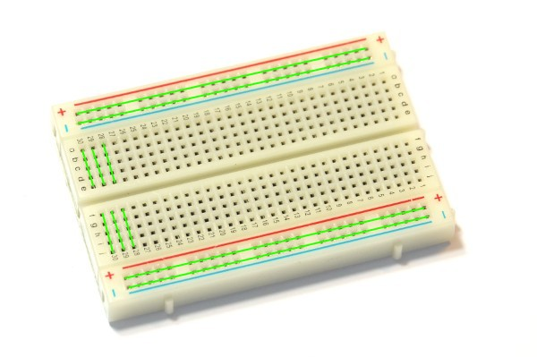

In the middle, the pins are shorted together vertically (the top and bottom halves are still separate) and at the far top and bottom, everything is connected horizontally.

By plugging the display in right above the Espruino you connected it to pins `B15`, `B14`, `B13`, `B10`, `B1`, `A7`, `A6` and `A5`, and Espruino was able to power the display directly from its IO pins (the comments for `GND` and `VCC` above).

### It's too dark!

You can change the contrast of the display using `g.setContrast(...)`. Try typing `g.setContrast(0.45)` on the left-hand side of the IDE and see if that helps, or experiment with different values.

To make sure your changes are kept next time you upload, copy the `g.setContrast(0.45)` line to the start of the LCD initialisation callback (where `g.clear()` is mentioned in the code above).

### Grab a button

Now let’s add a button. When we press the button we want the text to change from `Hello World!` to `Hello Fullstack!`.

Place the button along the bottom, with the left side matching the third pin along on the Espruino (`3.3v`) and the right side matching the fifth (`B4`). If you’re not sure which way round to place your button it only fits one way, you shouldn’t need to force it. So that’s pretty simple :)

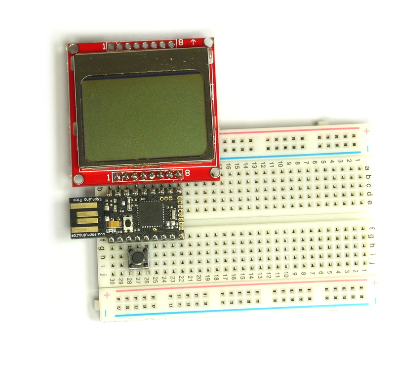

Now it’s connected to the 3.3v and `B4` pins. Type  `pinMode(B4, "input_pulldown")` into the left hand side of the IDE (the console), and press enter. This connects a resistor inside Espruino that makes sure the pin will read `0` when the button isn't pressed. Now type `digitalRead(B4)` into the left hand side and press enter. You should get a value of `0` returned. Now press down the button and run the command again, (you can press the up arrow just like a normal console), and you should get a reading of `1.` Great, our button works!

For our ‘pressing button’ code we’re going to use Espruinos own `setWatch` function, which uses Espruino's hardware to call a function if a pin changes state.

Add the following code to the end of the code on the right-hand side:

```
pinMode(B4, "input_pulldown");

setWatch(function(e) {
  if (!g) return; // graphics not initialised yet
  g.clear();
  g.drawString('Hello Fullstack!',0,0);
  // send the graphics to the display
  g.flip();
}, B4, { repeat: true, debounce : 50, edge: "rising" });
```

You code should now [look like this](screenChTxt.js].

Click the upload button again, and now when you press the button, it should print `Hello Fullstack!`.

### Now it’s your turn.

How would you alter the code so if you pressed the button a third time it greeted yourself: `Hello Joe Bloggs!`

## Task two: Super charging the button

So that’s the basics. But what about something fun to run? Rather than just changing the text when we press the button we could run a whole game! This is JavaScript after all!

Replace all the code in the right hand editor with the below and upload it onto your Espruino.

```
A5.write(0); // GND
A7.write(1); // VCC
A6.write(0); // Turn on the backlight

var g; // Define g globally, so that it can be used by other functions

var birdPos; // bird screen position
var birdVel; // bird velocity
var obstacles; // array of obstacles for flappy bird


function onInit() {
  // Setup SPI
  var spi = new SPI();
  spi.setup({ sck:B1, mosi:B10 });
  clearInterval();
  // Initialise the LCD
  g = require("PCD8544").connect(spi,B13,B14,B15, function() {
     gameStart(); 
  });
}

function gameStart() {
  birdPos = g.getHeight()/2;
  birdVel = 0;
  obstacles = [
    { x: g.getWidth()/2, y: 20, h: 15 },
    { x: g.getWidth(), y: 30, h: 10 }
  ];
  setInterval(onFrame, 50);
}

function gameOver() {
  clearInterval();
  g.clear();
  g.drawString("GAME OVER!", 20, 20);
  g.flip();
}

function onFrame() {
  // Step animation for bird
  birdPos += birdVel;
  birdVel = birdVel*0.9 + 0.1;
  // Step animation for obstacles
  obstacles.forEach(function(o) {
    o.x -= 1;
  });
  if (obstacles[0].x < -5) {
    obstacles.shift(); // remove first
    obstacles.push({ // add new
      x : 84,
      y : 10+Math.random()*24,
      h : 8+Math.random()*15
    });
  }
  // Test
  if (birdPos > g.getHeight()) return gameOver();
  if (obstacles[0].x < 8 && (
        birdPos<obstacles[0].y-obstacles[0].h ||
        birdPos>obstacles[0].y+obstacles[0].h)) return gameOver();

  // Draw!
  g.clear();
  // bird
  g.fillRect(0, birdPos-2, 4, birdPos+2);
  // obstacles
  obstacles.forEach(function(o) {
    g.drawRect(o.x-5, -1, o.x+5, o.y - o.h); // top
    g.drawRect(o.x-5, o.y + o.h, o.x+5, g.getHeight()); // bottom
  });
  g.flip();
}

pinMode(B4, "input_pulldown");
setWatch(function() {
  birdVel -= 2;
}, B4, { edge:"rising", repeat:true, debounce: 50});

onInit();
```

Now we have a fully fledged working version of flappy bird!

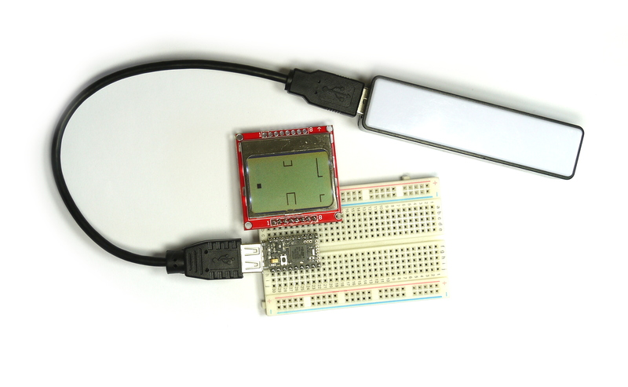

### Now it’s your turn

How would you get the game to restart after it says ‘Game Over’?  Could you add a running total to the code so you could keep score within the game?

### Making it work without a PC

At the moment, your code only runs after you've uploaded it to Espruino. If you unplug Espruino and re-plug it (or add it to a USB power pack) then nothing will happen.

To change this, just upload your code and the type `save()` on the left-hand side.

**Note:** This is why we put all the code we want to run at startup in a function called `onInit`. Typing `save()` saves the current state of your running code (including watches, timers and intervals), but jobs like initialising the LCD have to be done each time power is applied.

## Task 3: Adding more buttons

Let’s add 3 more buttons to our existing set up, so we can have an up, a down, a left and a right.

This is where it gets a little more complicated. It may be easiest to refer to the diagram below.

The third pin from the left is our 3.3 volt pin, all our buttons need this power on one of their pins. The other side of each of our buttons will go to one of the other pins to the right of this third pin. So the other side of the ‘left’ button with be connected to the forth pin from the left, the other side of the ‘right’ button will be connected to the fifth pin from the left and so on:

| Button | Connection |
|--------|------------|
| Left   | B3         |
| Right  | B4         |
| Up     | B5         |
| Down   | B6         |

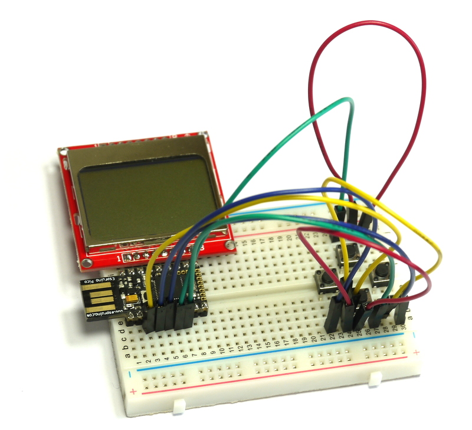

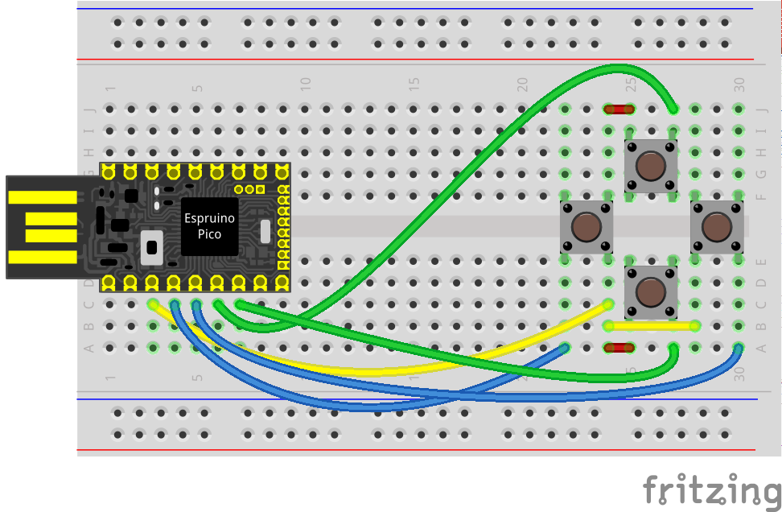

Now, we can add some code - this is makes a simple etch-a-sketch:

```
A5.write(0); // GND
A7.write(1); // VCC
A6.write(0); // Turn on the backlight

pinMode(B3, "input_pulldown"); // left
pinMode(B4, "input_pulldown"); // right
pinMode(B5, "input_pulldown"); // up
pinMode(B6, "input_pulldown"); // down

var g; // Define g globally, so that it can be used by other functions
var x=42, y=24; // starting point for drawing

function onInit() {
  var spi = new SPI();
  spi.setup({ sck:B1, mosi:B10 });
  clearInterval();
  g = require("PCD8544").connect(spi,B13,B14,B15, function() {
    g.clear();
    setInterval(onFrame, 50);
  });
}

function onFrame() {
  if (digitalRead(B3)) x--;
  if (digitalRead(B4)) x++;
  if (digitalRead(B5)) y--;
  if (digitalRead(B6)) y++;
  // don't clear the screen here
  g.setPixel(x,y,1);
  g.flip();
}

onInit();
```

After uploading, you should see a small dot in the middle of the screen. Press each button in turn to move the dot in that direction, leaving a trail behind it.

**Note:** In this case we're using `digitalRead()` to read the buttons because we don't care when the button was pressed - we're executing the `onFrame()` function many times a second anyway.

### Now it’s your turn

What could you make with this?

Some examples are:

* [Wire Loop Game](http://www.espruino.com/Pico+Wire+Loop+Game)
* [Snake Game](http://www.espruino.com/Snake)
* [A Piano](http://www.espruino.com/Pico+Piano)


## Extra: Tidying up

You've now got a massive bundle of wires on your breadboard. It'd be much better if these could be tidied up.

There's a roll of black solid-core wire and some wire strippers at the front of the room. Once you're happy with the layout of your buttons you could replace the overly-long patch leads with solid core wire of about the right length.


## Extra: Making Sounds

You can also make sounds - all you need is to connect the buzzer (the little black cylinder) to two pins on the Espruino board.

Ideally you should connect one side to the `GND` pin of Espruino (the bottom-left pin as it's shown on all the pictures here).

To get started easily, plug the buzzer in as shown (between the 1st and 4th pins) - this connects it to `GND` and `B3`.

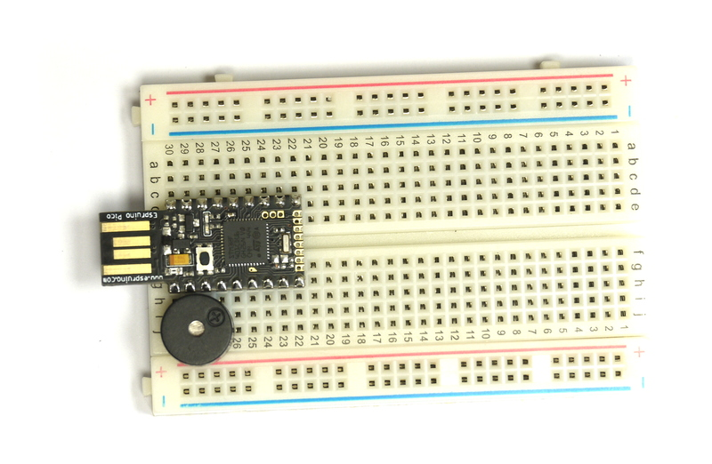

You can now output sounds of different frequencies with commands like: `analogWrite(B3, 0.5, { freq: 1000 } );`

To turn the beeping off (because it'll get annoying really quick!) try: `digitalWrite(B3,0)`

You can then use `setInterval` and `setTimeout` to play a sequence of notes and make music. For more information see [this tutorial](http://www.espruino.com/Making+Music).

You can use the buzzer on most pins - but they need to be capable of [PWM](http://www.espruino.com/PWM) - Pulse Width Modulation. Check on the card that came with your Pico (or [the Pico Reference](http://www.espruino.com/Pico)) for pins marked `PWM`.

You can also play sound effects and speech - check out [the Waveform page](http://www.espruino.com/Waveform), and load [this example](speechDemo.js) for an example of some speech.


## Extra: Flashing Lights

In [the Quick Start](http://www.espruino.com/Quick+Start) there was some information on flashing the onboard LEDs with `digitalWrite(LED1,1)` and similar - but you can do this with other LED lights too - there are a few included in your kit of parts.

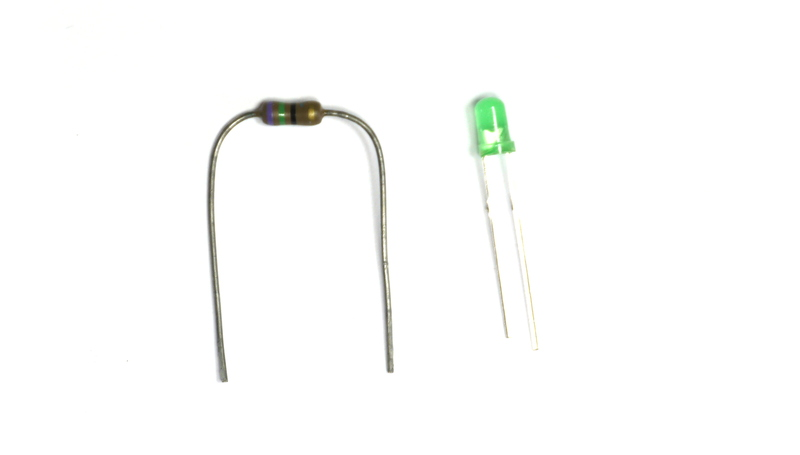

Unfortunately you're not supposed to connect LED lights directly to Espruino's GPIO pins, as without a resistor in series to limit current it's possible to damage things (although for short periods of time this is unlikely).

To connect an LED up, simply connect:

* GND -> Resistor -> LED (short Pin) -> LED (long pin) -> Any IO pin on Espruino
* GND -> LED (short Pin) -> LED (long pin) -> Resistor -> Any IO pin on Espruino

For instance as follows:

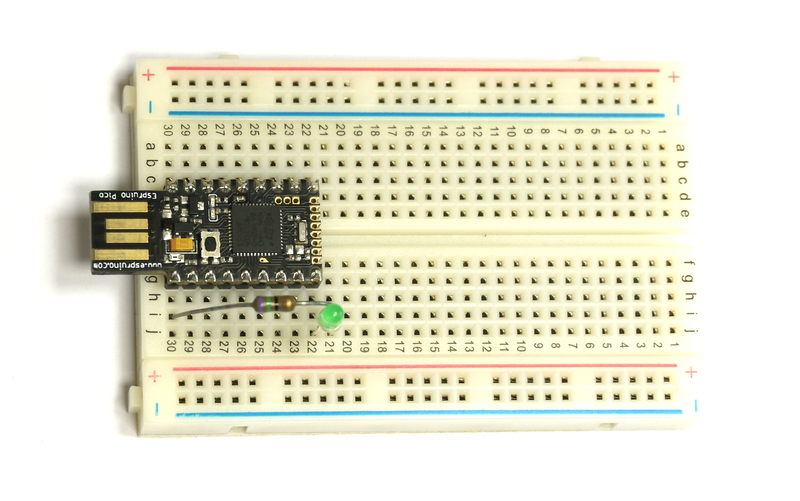

You can then execute `digitalWrite(A8,1)` to turn the LED on, `digitalWrite(A8,0)` to turn it off, or `analogWrite(A8,0.2)` to dim it to some value between 0 and 1.


